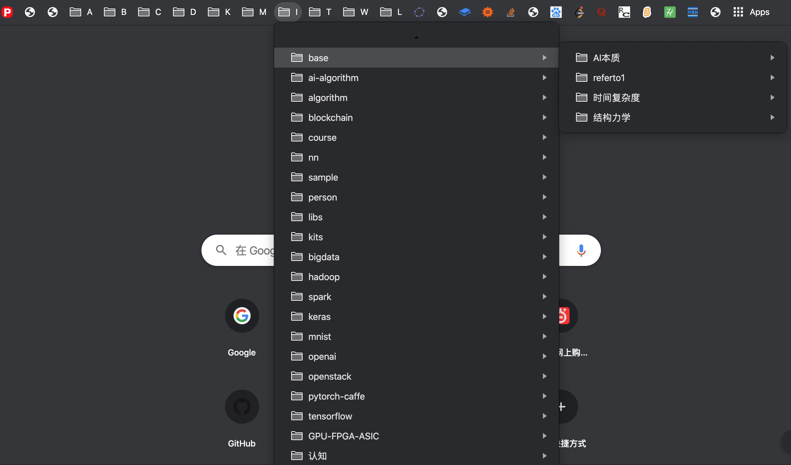
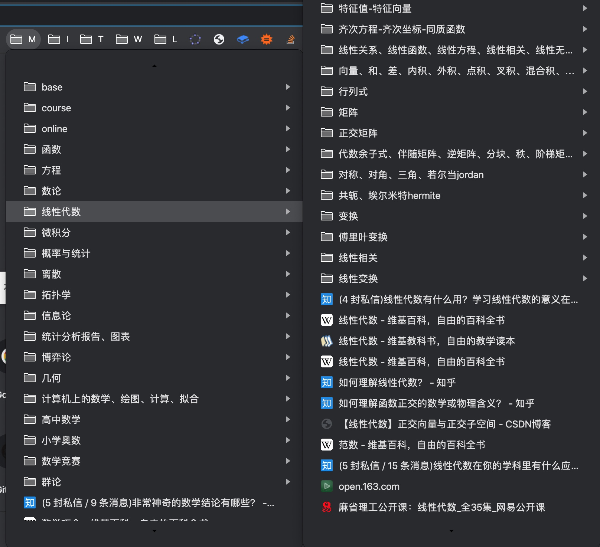
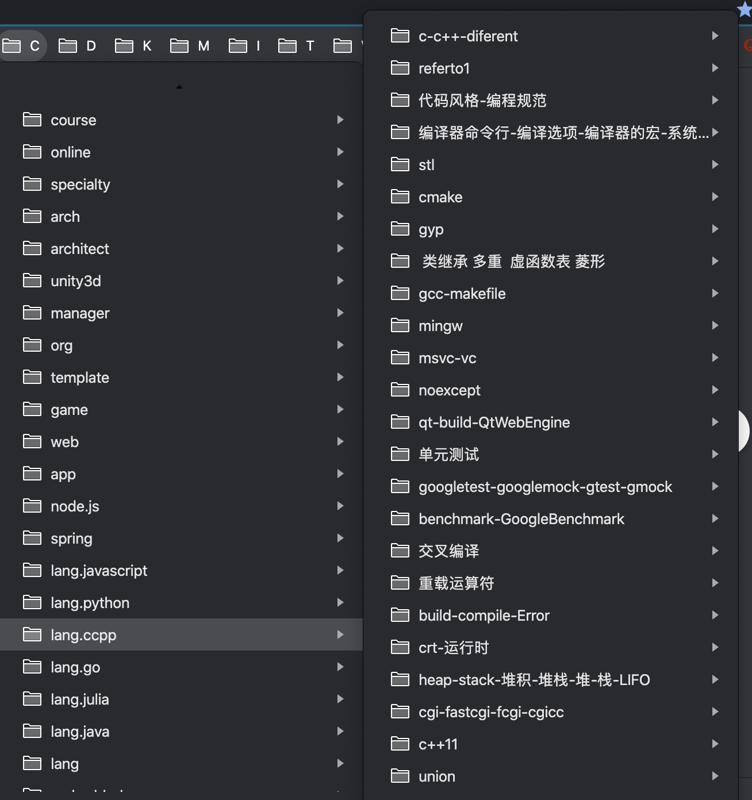
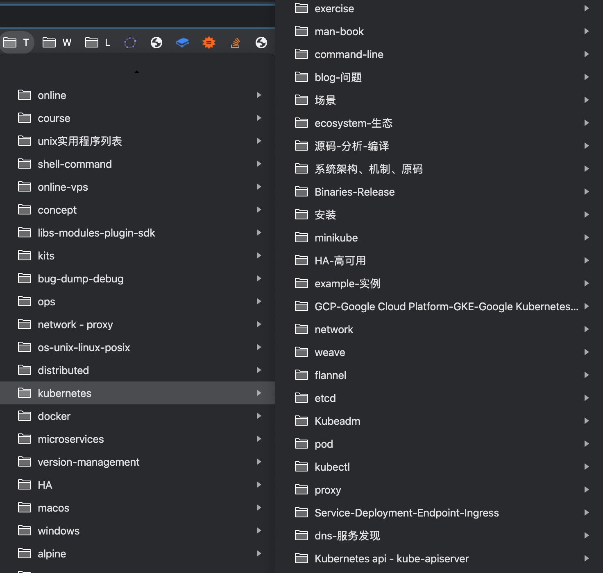

# 本人在Github中的部分资源 
> 注意下载代码时都： git clone "https://github.com/oudream/xxx.git" --recursive  
> 未列明的，请检阅：https://github.com/oudream?tab=repositories

- 文件[ chrome.bookmarks.html](https://github.com/oudream/bookmarks) 是一个网站地址的书签集。是分类记录了本人从2017以来，为了解技术而浏览的URL精选集。  
- 使用方法：可以直接下载打开查看（但看起来不方便）。也可以在Chrome浏览器书签栏中导入书签，即可（这样使用起来方便点，效果在看底下图片）。

## c && c++ 方面

- [c & c++ 跨平台基础库](https://github.com/oudream/ccxx)
    > 1. 使用c语言与c++实现，核心部分只是使用clib与stl，系统实现部分直接调用相关操作系统API，完全兼容unix4, posix。
    > 2. 此库已经并入unit test、benchmark test、cmake、进程监测、守护程序、异步库libuv、lua、cpython、re2、json、yaml、mysql、redis、opencv、openssl、qt、lz4、oci……
    > 3. 此库并非从零起步，而是参照了 stl、boost、qt、ucommon。
    > 4. 此库历经三年多持续开发，目前作为多个大型项目的底层支撑并正在运作着。

- [Socket高并发解决方案](https://github.com/oudream/hello-socket-model)                                                 

- [Cmake 的资料、入门、试验](https://github.com/oudream/hello-cmake)

- [LeetCode 算法的资料、入门、试验](https://github.com/oudream/leetcode)

## AI 人工智能方面

- [AI 的资料、入门、试验](https://github.com/oudream/hello-ai)

- [OpenCV 的资料、入门、试验](https://github.com/oudream/hello-opencv)

- [Excel 的资料、入门、试验](https://github.com/oudream/hello-excel)

## DevOps 

- [Linux Shell 的资料、入门、试验](https://github.com/oudream/hello-docker)

- [Ansible 资料、入门、试验](https://github.com/oudream/hello-ansible)

- [(Docker, Dockerfiler) 资料、入门、试验](https://github.com/oudream/hello-docker)

- [Kubernetes 资料、入门、试验](https://github.com/oudream/hello-kubernetes)

- [Jenkins 资料、入门、试验](https://github.com/oudream/hello-jenkins)

## Web

- [(HTML5, CSS3, ES5) 资料、入门、试验](https://github.com/oudream/hello-web)

- [Node.js 资料、入门、试验](https://github.com/oudream/hello-nodejs)

- [Puppeteer 的资料、入门、试验](https://github.com/oudream/hello-java)

- [Rest ( restful ) 的资料、入门、试验](https://github.com/oudream/hello-rest)

## Go 语言

- [Go语言的资料、入门、试验](https://github.com/oudream/hello-go)

## Python 语言

- [Python语言的资料、入门、试验](https://github.com/oudream/hello-python)

## Java 体系
- [Gradle 的资料、入门、试验](https://github.com/oudream/hello-gradle)

- [Java 语言的资料、入门、试验](https://github.com/oudream/hello-java)

- [Spring 语言的资料、入门、试验](https://github.com/oudream/hello-spring)

## 大数据
- [Dimi gcl3平台在hadoop的应用](https://github.com/oudream/dimi)

## c# 
- [c# 语言的资料、入门、试验](https://github.com/oudream/hello-csharp)

## Unity （待建……）

- 

## 其它
- [2004~2005年做的网站](https://github.com/oudream/wwwroot)

- [其它(Hadoop、ffmpeg)不一一罗列，->](https://github.com/oudream)

- PSM是2015年实现自设计及实现的私有规约，有[c++ 开放部分](https://github.com/oudream/ccxx/blob/master/ccxx/cxpacket.h)、[js](https://github.com/oudream/hello-nodejs/blob/master/3rd/csm-3/protocol_psm.js)、[java项目代码中不开放]三个版本

## 部分 bookmark

